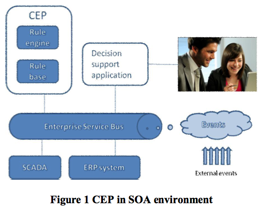
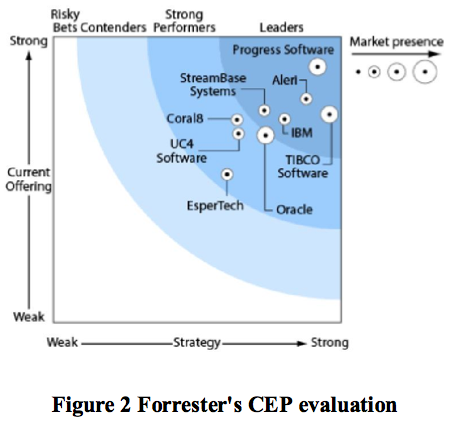

CEP的定位
=========

CEP是对海量的事件进行实时/准实时处理的基础设施架构组件。CEP对事件的处理过程是一个推理的过程：
，通过

CEP的目标是对海量的事件进行(准)实时的过滤、关联、聚合，通过模式匹配生成带有业务含义的复合事件(Complex
Event)并分发。

CEP的处理过程是一个推理的过程：

1.  捕获事件
2.  根据定义好的业务知识进行推理
3.  形成结论

在CEP的处理过程中，有几个关键点：

1.  事件流 CEP不仅仅要处理静态。。。

    流：基于假设：时间价值

流：和传统数据库相比，CEP侧重动态数据的持续查询，这些数据很形象的用流来表示。就像河流一样，流只是一个管道（channel），数据从它流过。
流可以通过某个时间有某些数据流过来抽象表示。在一个时间戳里，有0个，1个或多个数据流过。
流默认是不需要持久化到数据库的，因此它是没有状态的。
一般用CEP来分析问题时，那些外部系统的所有数据，都需要通过定义流来引入到CEP的持续查询中。

CEP的主要领域：

-   活动数据搜索
-   事件流处理
-   分布式系统

与EventStreamProcess相比，CEP中的事件更加同质化，而且ESP更关注计算，CEP更关注模式匹配、聚合和产生新事件。

CEP与EDA
--------

CEP与ESP
--------

文章来源Michal Bali的《Drools JBoss Rules 5.0 Developer\'s
Guide》一书中CEP的章节部分内容。笔者翻译了过来，供大家了解Drools
Fusion，CEP的概念。

规则通常或多或少操作于静态数据集（事实）。然而，对于一些系统，有必要定义时间关联的事实。他们通常叫做复杂时间处理（CEP）或者是事件流处
理（ESP）。Drools Fusion，从5.0版本开始，提供了滑动窗体（sliding
windows）,时间运算符（temporal operators），类型声明（type
declarations）于一体的支持。 CEP 和 ESP CEP 和 ESP 是
事件驱动架构（Event Driven
Architecture）处理模式(更多关于事件处理架构的信息：
<http://elementallinks.typepad.com/bmichelson/2006/02/eventdriven_arc.html>)。
这个架构的一个主要的好处就是提供了组件的松耦合。一个组件可以发布正在执行的动作事件，其他组件可以订阅/监听这些事件。发布者和订阅者不知道对方的存
在。一个订阅监听事件者不关心事件的来源。相似的，产生事件的生产者也不知道任何监听这些事件者的任何事情。一些编排层处理实际的订阅、发布之间的装配。
一个事件代表有意义状态的改变。它通常由一个事件头和事件体组成。事件头包含了名称，发生时间，持续时间等元信息。事件体描述了发生了什么。例如，如果一个银行交易被处理，事件体应该包含交易的ID，交易数量，本人帐号，转账帐号等。
CEP
处理复杂事件。一个复杂事件是简单事件的集合。比如，一系列的巨额提款激发可疑交易事件的发生。一个复杂事件的发生是由一系列简单事件的引导形成的。
ESP
是更实时(real-time)的大量事件处理。例如，根据时间计算实时平均交易量。
更多关于CEP和ESP的信息：http://complexevents.com/ 、由作者Prof. David
Luckham编写的《The Power of
Events》。这本书被认为当今研究和发展CEP的里程碑。
现在有很多完整的CEP/ESP 引擎，包括商业的和开源的。Drools
Fusion支持事件以增强编程式规则。它使用Rete算法并提供一个可选的引擎。

Drools Fusion Drools Fusion 是业务逻辑集成平台（Business Logic
Integration
Platform）一部分的一个Drools模块。Drools事件处理引擎支持CEP和ESP。每个事件有一个类型，一个发生时间，它也许还有
持续时间。时间点（零持续时间）
和基于时间间隔的事件都是被支持的。事件也可以像其他事实一样包含其他数据------name和type属性。所有的事件都是事实但是并不是所有的事实都是事
件。一个时间的状态不应该被改变。不过，给没有赋值的值赋值是合法的。事件有一个明确的生命周期窗，当生命周期窗结束后可能有透明的垃圾回收机制（比如，
我们只对最近24小时内交易感兴趣）。规则能够处理事件之间的时间关系。

基本概念
--------

-   流（Stream）
-   窗口（Window）
-   关联 （Join）
-   模式匹配 （Pattern Match）

窗口：窗口也是用来放数据的，类似于数据库表。
和流相比，不同点是窗口是有状态的。和传统数据库表相比，不同点是窗口是有时间戳的，
时间信息不是存在数据中，而是由窗口维护的。

流里面可能装着你的原始数据或最终结果，在持续查询中，你可能将你关注的数据放在窗口中监控，关联和计算。
窗口是有状态的，怎么理解？想象一下流，只是一个管道，你只知道某个时间点流出一些数据，你不知道它内部还有多少数据，上一个时间点和下一个时间点有什么联系，所以我们可以说流是没有状态的。而窗口呢，某个时间点，你知道它里面有哪些数据，下个时间点某个数据进入窗口，窗口里装的数据集会更新，你可以理解它的状态更新了。
怎么比喻窗口才更形象？窗口是你的关注点（focus）。事件可能一直在发生，可能从很久很久以前，到永远也不会停止；但你关注的不是全部，而是有意义的部分数据。比方说一天内的数据，连续1000行数据里，所有符合某个条件的数据等等。你需要用窗口来抽象这些你关注的数据，将这些数据的状态和变化情况放到窗口种监控和计算。窗口是你在分析问题，解决问题的过程中不断抽象出来的产物，如何设计效率更高的窗口也是CEP应用中的技巧，类似在传统数据库中如何设计小巧，冗余数据最小和效率最高的数据库表。
窗口的输入和输出是什么样的概念？

设计模式
--------

### 过滤（Filter）

这是最常见的应用场景。过滤大量数据，留下有意义的和你需要的数据。输入数据流进入CEP引擎后，按照过滤条件，过滤掉无关紧要的数据。

### 内存缓存 (In-memory caching)

内存缓存是最基本的CEP设计模式。缓存主要存储两类数据，一个或多个流中最近的事件，一个或多个数据库表中的数据。缓存可以根据最近使用算法。

### 窗口间聚合（Aggregation on windows）

Count-based/time-based window, sliding/jumping window Output policy
(continuous, periodic) Aggregation (average, min, max, sum, count)

### 数据库查询 (Database lookups)

Cache, granular caching and access, concurrent lookup
在CEP引擎中，每个查询可以根据进来的事件来访问数据库来获取历史或相关上下文。为了获得好的访问性能，必须将需要的数据缓存起来。因此一个好的缓存机制对性能至关重要。缓存整个数据库对小数据量来说还可以接受，但当数据量很大时，就需要粒度合适的缓存。另外，对于大部分的应用，并发查询数据库不阻塞整个系统是必须的。

### 数据库写 (Database writes)

batching, asynchronous writing, queue
某些CEP的查询需要直接把原始事件或计算后的结果直接存入数据库。因此数据库必须能存放海量数据，这个设计模式要求一系列的高级技术，例如批量提交，异步写，队列，同步写，通过数据库原始接口写入。

### 关联／联合 （Correlation/Joins）

index
关联多个数据流是CEP查询最有用的模式。这需要引入一个或多个窗口（Window）。流（Stream）不会存储事件，只是让事件通过，就像河流一样。为了执行关联，必须将很多事件存在内存里（窗口），等待其它流上的事件进入来进行关联。
关联是极耗CPU的，因此我们需要索引技术来提供性能。和传统数据库索引不同的是，CEP的索引要求非常动态。

### 事件模式匹配 （Event pattern matching）

A followed by B: B在A后面出现 A and B: A和B都出现 A or B: A或者B出现 Not
A: A不会出现 模式匹配常用于欺诈识别，流程监控和网络安全。

### 状态机 （State machines）

通过状态自动机来建模复杂行为和流程。在CEP环境里定义有限状态自动机需要考虑几点：元数据存在数据库里，跟踪多个流程，应对异常情况。

### 层次化事件（Hierarchical events）

事件不是传统数据库表的简单结构，而是更复杂的多层结构，使用XML表示是最合适的。相应的查询只能基于XQuery语法来进行。

### 动态查询 （Dynamic queries）

Register, Subscribe, Query template.
动态注册：在很多应用里，不重启服务器而使用编程的方式动态注册查询模块，是非常重要的。这里不光是查询，也包括数据流，发布者和订阅者。所有这些都需要被动态添加。
请求／响应查询：某些情况下，一些查询需要和用户交互才能输出结果。最常见的是输入查询时间段然后查询CQ里的bug。我们称这些查询是参数化的查询。
订阅查询：类似上面的查询。其区别是前者立即返回结果，而订阅查询需要持续查询，结果会持续地通知查询方。类似RSS订阅。

环境：CEP与SOA
==============

在SOA架构中，CEP监控EDA环境中的事件流，从中提取有用的信息，并与定义好的模式进行匹配。

CEP产品对比
===========

Forrester evaluated following products: Aleri Streaming Platform 3.1,
Coral8 Engine 5.6.0, Esper Enterprise Edition 2.3.0, WebSphere Business
Events 6.2.0, Oracle Complex Event Processing 10gR3, Progress Apama
4.0.1, StreamBase Event Processing Platform 6.2, TIBCO BusinessEvents
3.0 and UC4 Decision and UC4 Insight 3.2. The evaluation criteria were
current offering representing provided features within its CEP platform
(runtime architecture, platform administration, event processing
features, development tools, business end-user tools, standards and
interoperability) and strategy representing products road map, and other
strategy elements (vendor's product and corporate strategies and the
costs associated with vendors offering). The following picture shows the
score where vertical axis represents current offering and horizontal
axis represents strategy.

Forrester的CEP调研中，对于开源产品只纳入的Esper。Esper在运行时架构、平台管理、事件处理等方面很强，不足之处是

管理员和业务人员的工具方面。这也是开源产品的通病。

但，Drools可以说是最好的、使用最广的规则引擎；而Drools
Fusion提供了CEP的特性，很值得对比一番。

选型要素
========

确定选型要素，可以明确目标，避免主观性。CEP选型的主要因子包括：

-   直观方便的事件定义(specification)

Comfortable and intuitive specification of events is needed because
rules should also be understandable to people that do not know much
about complex event processing. The rules are likely to be defined by
emergency experts in our example and it would be beneficial if they
could write rules without the help of knowledge engineers.

不懂开发的业务专家也能够理解和定义规则

-   对事件流和静态数据的集成

    比如，MQ,数据库等

In many cases, data contained in events is not sufficient for the
evaluation. Some data that is needed for evaluation might be stored in a
database or facility ontology, for example. For instance, we may get the
event that the temperature detector TD007 measured a temperature of 45
degrees Celsius, but the location of each sensor is stored in facility
ontology or its translation into the database. This makes integration of
event streams and static data an important requirement.

-   事件定义(specification)易于修改

Critical infrastructure's emergency procedures change over time, which
may require the rules to change as well. It is a great advantage to have
event specification that is easily modifiable in order to adapt to
changes without the facility management system being out of function.

-   事件处理能力

    -   多事件流

    Whether it is a business or facility management, it is

likely to get events from various sources. Fire detection and
ventilation system might be separate control systems delivering events
in a different manner. The event engine has to be able to make a
difference between events coming from different sources, i.e. it has to
be able to process multiple streams.

-   事件回收(recovery)

Recovery is needed in unpredictable situations where engine may fall
down and we do not want to lose data after restart.

-   日志

Logging is needed for the purpose of debugging and analyzing the system
behavior and effectiveness as well as for post mortem analysis and for
emergency personnel training purposes.

-   时间模型

There are two possible time models: application- and system- time model.
System-time model means that events are time-stamped when they are
received by the engine. On the other hand, application-time model means
that events are time-stamped by the application, for example by setting
the time value of the timestamp field. In general, application-time
model provides more accurate timing, since events can be time-stamped at
the source. This may be important because the time that it takes for
events to get from the source to the event engine can vary and thus
influence the processing of the engine. Unfortunately, application-time
model is not easy to implement and many CEP solutions either provide
just system-time model or they provide application-time model with
limited capabilities.

-   事件消费方式

Unfortunately, application-time model is not easy to implement and many
CEP solutions either provide just system-time model or they provide
application-time model with limited capabilities.

-   从事件中提取数据

Extracting and using data in events and event pattern detection, as well
as extensive temporal relations, are essential requirements in order to
have true complex event processing (where temporal relations are crucial
for the correlation and aggregation of simple events).

-   模式识别(detection)
-   时间关联（时空推理）------累积(accumulation)、聚合(aggregation)和否定(negation)

产品比较
========

                         Drools     Esper            Progress   Apama   TIBICO
  ---------------------- ---------- ---------------- ---------- ------- --------
  简单直观的事件定义     Y          EPL(类SQL语言)   Y                  
  集成事件流和静态数据   Y          Y                Y                  
  方便更改事件定义       Y          Y                Y                  
  处理多事件流           Y          Y                Y                  
  recovery回收？         N          Y\*              Y                  
  日志                   Y          Y                Y                  
  应用时间模型           Limited    No               -                  
  消费途径？             Non        Non              -                  
  提取事件中的数据       Y          Y                Y                  
  事件模式检测           Y          Y                Y                  
  时序关联               Y          Good             Y                  
  累积、聚合、否定       Y          Y                Y                  
  复杂行为定义           Java代码   Java代码         Y                  
  性能                   好         很好             最好               
  HA                     N          Y\*              Y                  

